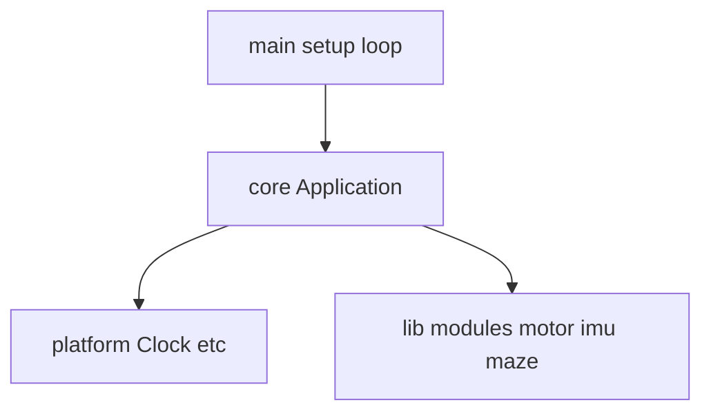

# Architecture

Firmware for the Robosam / MEB Robot micromouse platform.

## Layers

1. **core** — Hardware-independent application lifecycle (`Application`, shared `Status` / `Result`).
2. **platform** — Time and pin abstractions; keeps Arduino/HAL differences in one place (DRY).
3. **lib/** — Each module is its own PlatformIO library; only public API headers are exposed.

## OOP and DRY

- Modules extend via **interface** (pure virtual) + **single concrete implementation**; e.g. future `IMotorDriver`, `IImu`.
- Error codes from a single source: `aratmicro::core::Status` and `Result<T>`.
- Non-copyable classes (Application) are protected with Rule of Five.

## Test strategy

- Algorithms and core logic: `env:native` + Unity, file naming `*.test.cpp`.
- Embedded integration: a separate `test/embedded/` environment may be added later.

## Flash data (future)

If maze maps or calibration data are stored in flash:

- Build: `-Os`, LTO, `--gc-sections` (see `platformio.ini`).
- Data: compressed block (RLE or LZ variant); not fully expanded into RAM at boot — decode on demand.

STM32F411 has no separate EEPROM; persistent storage = **Flash**.

## Planned modules

| Module | Location | Notes |
|--------|----------|-------|
| DRV8833 | `lib/motor/` | PWM / direction pins |
| MPU6500 | `lib/imu/` | I2C, gyro + accel |
| Maze solver | `lib/maze/` | Flood fill on 16×16 grid; `FloodFillSolver` |

The maze module is host-tested (`pio test -e native`). Motor and IMU modules are **not yet present**.
